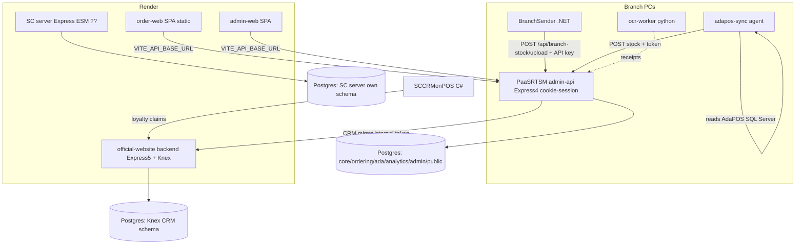

# Architecture Assessment & Mobile PDA App Design

> **Status:** Advisory / design notes. No production code written yet.
> **Captured:** 2026-06-22
> **Scope:** (1) Whole-workspace architecture assessment, (2) Design discussion for a new mobile "PDA" app (barcode scan → price/stock/expiry) including its auth/enrollment model.

## Decisions locked in this session

| # | Decision | Choice | Notes |
|---|---|---|---|
| D1 | Expiry tracking model | **Model B — periodic expiry survey (snapshot)** | Model A (full lot/batch tracking) is a future eventuality, **not now**. Reason: turning the company into true Model A takes a long time and requires controlling receiving + POS (AdaPOS), which we don't. |
| D2 | Mobile app platform | **Native (React Native)** | Not urgent, so we can invest more time than a PWA. PWA-first was the cheaper option but rejected in favour of a fuller native build. |

Still open (to decide before building tables/endpoints):
1. 24h credential bound to **device** vs **person-lite** (recommended: person-lite — tap your name, no password). Changes the data model.
2. Authority matrix per §"Authority / data matrix" — confirm, esp. whether Sales sees cost/margin.
3. One "branch master" account per branch; who enrolls the branch master device first (likely admin = you).

### Kickoff decisions (2026-06-22)
- **K1 — Start with a Backend evidence spike** (read-only) to confirm price/stock/barcode reality before building. → **Done, see "Phase 0 spike findings" below.**
- **K2 — Auth: build the QR enrollment system FIRST**, then Phase 1 feature endpoints ride on top of it (user chose the secure-but-slower path over an interim branch-login).
- **K3 — The React Native app lives in a NEW separate repo** (e.g. `SC-StockDay-PDA`), not inside the SC-StockDay-Ordering npm/Vite workspace (native toolchain isolation).

### Phase 0 spike findings (confirmed from real migrations + import scripts)
Closes the prior "price source unknown". All paths verified against schema/importer, **not** live data.

1. **Barcode → exactly one product.** `public.barcodes` has **PK = `barcode`** (unique), so `WHERE barcode = $1` returns 0 or 1 `sku_id`. **No disambiguation UI needed.** Table is upserted live by `import_adapos_prices`.
2. **Retail selling price** = `public.sku_unit_prices.retail_price` (per `sku_id` + `unit`, `is_active`), maintained live by the price importer; price tiers in `public.sku_unit_price_tiers` (tier 2–8). Legacy `public.prices` is written in parallel but `sku_unit_prices` is canonical. **Cost ≠ selling price** (cost lives in branch_stock, below).
3. **Per-branch stock + cost** = `ada.branch_stock_snapshots`, PK `product_code` (= `skus.company_code`): `qty_branch_000..005` (on-hand per branch) + `qty_total_all_branches` + `cost_avg_branch_000..005` (Manager-only). Also denormalizes name TH/EN, barcode, unit.
4. **Join path (verified):** `barcode` ─PK→ `barcodes.sku_id` → `skus`(company_code, uom, display_name) + `items`(display_name, generic_name) + `sku_unit_prices`(retail_price by unit) + (via company_code) `ada.branch_stock_snapshots`(per-branch qty/cost).
5. **Residual (non-blocking):** schema columns exist, but **data completeness** (% of SKUs with retail_price / barcode rows) needs a read-only query against the live DB when access is available.

**Planned Phase 1 endpoint:** `GET /api/products/by-barcode/:barcode` (narrow branch token) → `{ productCode, nameTh, nameEn, unit, retailPrice, priceTiers, stockByBranch{000..005,total}, costByBranch (Manager-only), barcode }`. Exact path for scans; the existing fuzzy `/products/search` stays for typed code/name lookup.

---

# Part 1 — Architecture Assessment: SC Retail Software Workspace

## Scope note & confidence
Assessment covers the six active in-scope repos (the working directories). The workspace root has ~40 folders, but most (`Clasp*`, `Rx1011*`, `scGlam*`, `smartcard-reader*`, `mockupshopee`, etc.) are prototypes/GAS scripts/one-off tools and are out of scope. **Confirmed facts** come from reading entry points, configs, migration lists. **Assumptions** are labeled. Biggest gap: no visibility into the live Render dashboard or production DB; deployment wiring is inferred from `render.yaml` + `.env.example` (never the secret `.env`).

## 1. Workspace map

| Repo | Role | Stack | Entry point | Connects to |
|---|---|---|---|---|
| **PaaSRTSM-project** | **The live backend + drug-DB admin.** Inventory/ML/ordering/stock-requests API. | Node CJS, Express 4, `pg`, pgvector, `mssql`, `xlsx`, bcryptjs, JWT cookie sessions | `apps/admin-api/src/server.js` | Shared Postgres (schemas `core/ordering/ada/analytics/ingest/admin/public`); both SC web apps call it; mirrors to official-website CRM |
| **SC-StockDay-Ordering** | Branch ordering + stock-request UIs, plus a **second legacy Express server**, an AdaPOS sync agent, and a Python OCR worker | npm workspaces: `apps/order-web` + `apps/admin-web` (React/Vite), `server` (Express ESM, legacy), `apps/adapos-sync` (Node), `apps/ocr-worker` (Python) | `apps/*/main.jsx`; `server/src/index.js` | order-web/admin-web → PaaSRTSM admin-api; `server` → its own Postgres; adapos-sync → branch SQL Server → admin-api |
| **SC-StockDay-Ordering-BranchSender** | Per-branch PC agent that pushes local stock snapshots | .NET | `src/` | `POST /api/branch-stock/upload` on admin-api |
| **currentSC-official-website-project** | Public marketing site + CRM/loyalty/member backend + several embedded LIFF/form modules | Express **5**, Knex, `pg`, SendGrid, pdf-lib, R2/S3; React frontend | `backend/server.js` | Own Postgres (Knex migrations); receives CRM mirror from admin-api; serves rx1011/digitalpjk/scglamliff/reactnjob modules |
| **SCCRMonPOS** | C# POS loyalty integration (CRM-on-POS) | C# / .NET | `SCCRMonPOS/` | POS terminals; loyalty claims feed CRM |
| **ClaspSCShift** | Google Apps Script shift tool (only `memory/` is in scope) | GAS | — | Standalone |

**Correction to prior notes:** the SC `server/` is **not fully dead.** `SC-StockDay-Ordering/render.yaml` deploys it as a live Render **web** service (`sc-stockday-ordering`, `autoDeploy: true`, runs `db:migrate` on deploy, owns a `DATABASE_URL`). See finding H-1 — this is the single most important thing to clarify.

## 2. System architecture



In plain English: branch computers push stock data up to **admin-api** (the hub). Staff use two React SPAs (branch ordering + admin) that all talk to admin-api over cookie-authenticated CORS. admin-api also does the ML/categorization/embeddings work for the drug database and **mirrors member/CRM data into the official-website backend**, which independently serves the public website, loyalty, and a cluster of embedded form modules. A C# POS app feeds loyalty claims into the website backend. There are **three separate Express backends and at least two—probably three—separate Postgres databases.**

## 3. Data & API flow (and duplicate-source-of-truth risks)

**Stock data (core flow):** AdaPOS SQL Server (per branch) → `adapos-sync` agent **or** `BranchSender` → `POST /api/branch-stock` → wide table `ada.branch_stock_snapshots` (PK `product_code`, columns `qty_branch_000..005`, one `synced_at`) → `GET /api/branch-stock` → admin-web comparison table.

- ⚠️ **Two uploaders, one endpoint.** Both `BranchSender` (.NET) and `adapos-sync` (Node) can write branch stock → last-writer-wins races on the snapshot row. Confirm only one is active per branch.
- ⚠️ **Wide-column stock table** (`qty_branch_000..005`) means **every new branch is a schema migration + code change.** Known scaling cliff (see M-2).

**Ordering / inter-branch stock requests:** order-web → `POST /api/stock-requests` (admin-api, `ordering` schema) → approve/dispatch/receive lifecycle → packing documents. Migrations 033–037 own this; most recently active feature area.

**CRM mirror:** admin-api `integrations/currentScCrm.js` pushes to official-website `/internal` routes using `CRM_MIRROR_INTERNAL_TOKEN`. Cross-system write with eventual consistency — confirm it's idempotent and logged.

**Duplicate sources of truth flagged:** (1) branch stock has two writers; (2) loyalty/CRM logic exists in admin-api **and** official-website **and** SC server; (3) product categories exist in both SC server migrations (010–012) and PaaSRTSM migrations (020, 026–027). Which is authoritative is not self-evident from code.

## 4. Database review
- **admin-api DB**: well-structured, schema-segregated, 37 sequential SQL migrations run via `scripts/db_migrate.js`, uses pgvector (012/013/025). The mature one.
- **Migration hazard — duplicate numeric prefixes:** PaaSRTSM has **two `020_`** files; SC server has **two `002_`** and **two `014_`**. A naive sorted-order migrator can apply these nondeterministically. Verify ordering is deterministic and all envs are at the same point. (H-2)
- **Three migration systems, three styles:** raw SQL + custom runner (admin-api), raw SQL + custom runner (SC server), Knex `.cjs` (official-website). No single source of truth for production shape.
- **Audit CHECK-constraint class of bug** (migration 035 story): app-level role enums historically out of sync with DB CHECK. Worth a one-time audit that every app enum (roles, statuses, enrichment states) matches its DB CHECK.
- FK coverage / index strategy across `ada`/`ordering` joins not yet verified — flag for a deeper pass.

## 5. Security & operational review

**Critical**
- **C-1 — Audit writes can crash the process (unguarded).** A failed `audit_logs` insert (CHECK violation) took down admin-api with an uncaught error. Migration 035 fixed the symptom; the *unguarded audit write* is still the root risk. Audit failures must never crash the request path. Highest-value fix.

**High**
- **H-3 — CORS header bug in admin-api.** `server.js` calls `res.setHeader("Access-Control-Allow-Headers", a, b, c)` with **four arguments**; `setHeader` takes only `(name, value)`, so the intended `X-API-Key` allowed header is not actually sent. Either dead intent or latent breakage.
- **H-4 — `CORS_ALLOW_ALL` + credentials.** Code reflects the request origin and sets `Allow-Credentials: true`. With `CORS_ALLOW_ALL=true` this is "allow any origin with cookies." Confirm production sets explicit `CORS_ALLOWED_ORIGINS` and `CORS_ALLOW_ALL=false`.

**Medium**
- **M-3 — Auth identity is env-encoded.** Users, password hashes, branch mappings live in env strings. Adding/rotating a branch user = redeploy; a malformed env string silently drops users. Fine now; hurts as branches grow.
- **M-4 — Middleware ordering in official-website.** `server.js` mounts `reactnjob`, `digitalpjk`, `scglamliff` routers **before** `express.json()`. Confirm intentional.
- **M-5 — Verbose env logging** on boot (SET/MISSING, not values — low risk).

**Operational**
- Render free/starter plans cold-start/sleep — risky if the CRM mirror target is asleep when admin-api pushes. Confirm the mirror retries.
- No notification/alerting layer; stock/financial operations rely on log lines only.

## 6. Maintainability review
- **Three Express backends, two overlapping in domain (loyalty/CRM/categories)** — central maintainability tax.
- **The SC `server/` is a zombie risk** — full routes/repos/16 migrations/tests, but frontends point elsewhere; still auto-deploys and runs migrations. Ambiguity itself is the problem.
- **Large monolithic admin-web `App.jsx`** — UI carries business logic; hard to test.
- **Heavy doc/log litter** in repo roots (`.codex-*.log`, `SESSION_*.md`, `HANDOFF_*.md`, `apps/adapos-sync/logs/*`).
- **Good signals:** admin-api cleanly modular (routes/services/auth/utils), real tests (`node --test` + supertest, ~181 passing), E2E harness exists, config parsing centralized and defensive.

## 7. Priority recommendations

### Fix now
| # | Problem | Impact | Approach | Risk | Size |
|---|---|---|---|---|---|
| C-1 | Audit write failures crash admin-api | Whole API down on a bad audit row | Wrap audit inserts in try/catch; never in the critical path | Low | S |
| H-3 | CORS `setHeader` 4-arg bug | `X-API-Key` clients silently fail / dead intent | Fix to single comma-joined value; verify clients | Low | S |
| H-1 | Unclear if SC `server/` is a live second backend | Two backends + two DBs + auto-migrate on deploy = silent drift | Decide & document; if dead set `autoDeploy:false` and stop its migrations | Med | S–M |

### Fix before scaling
| # | Problem | Impact | Approach | Risk | Size |
|---|---|---|---|---|---|
| H-2 | Duplicate migration prefixes | Nondeterministic apply order → env drift | Audit migrator ordering; consider renumbering with a recorded ledger | Med | M |
| H-4 | CORS allow-all + credentials | CSRF/cookie exposure if misconfigured | Enforce explicit allowlist in prod; assert at boot | Low | S |
| M-2 | Wide `qty_branch_000..005` stock table | Every new branch = migration + code change | Plan a long table behind a view preserving the wide read API | Med | L |
| — | Two stock uploaders, one row | Last-writer-wins races | One writer per branch; add `source` column + upload log; idempotent upload | Med | M |

### Improve later
- Consolidate loyalty/CRM ownership to one service; make others pure clients.
- Move env-encoded users to a DB-backed users table as branch count grows.
- Repo hygiene: gitignore `*/logs/`, `.codex-*.log`; archive `SESSION_*`/`HANDOFF_*` into `docs/history/`.
- Break admin-web `App.jsx` into feature modules; push business rules out of components.

**Recommended first move:** C-1 (audit crash hardening) + H-1 (resolve SC-server deployment ambiguity).

---

# Part 2 — Mobile PDA App: expiry workflow, architecture & auth (advisory)

> Original consulting answer (Thai), captured verbatim in substance.

## 1) คลายปมที่งงที่สุด: "ของเข้าๆ ออกๆ แล้วจำนวนหมดอายุจะยังไง"

มี **2 โมเดลที่ต่างกันคนละโลก**:

**โมเดล A — Lot/Batch tracking (ERP เต็มรูปแบบ):** ทุกครั้งของ *เข้า* บันทึก "ล็อตนี้ วันหมดอายุนี้ จำนวนนี้" และทุกครั้ง *ขายออก* ระบบตัดสต็อกจากล็อตที่ใกล้หมดก่อน (FEFO) → รู้ตลอดว่าเหลือกี่ชิ้นหมดเมื่อไหร่.
👉 **ร้านทำไม่ได้ตอนนี้ และไม่ควรพยายาม** เพราะ POS จริงคือ AdaPOS ที่ตัดสต็อกเป็นจำนวนรวมต่อสินค้าต่อสาขาตัวเดียว (ตารางจริง `ada.branch_stock_snapshots` เก็บแค่ qty รวม ไม่มีมิติล็อต) แก้ตอนรับเข้า/ขายไม่ได้ → ข้อมูลล็อต+วันหมดอายุไหลเข้าระบบอัตโนมัติไม่ได้ มันอยู่แค่บนกล่องที่ชั้น.

**โมเดล B — Periodic Expiry Survey (สำรวจของใกล้หมดอายุเป็นรอบ)** ← **เลือกใช้ (D1)**
เป็น **"ถ่ายรูป ณ เวลาหนึ่ง" (snapshot)** ไม่ใช่ยอดคงเหลือสด พนักงานเดินสำรวจ เจอตัวใกล้หมด ยิง → บันทึก "วันสำรวจวันนี้ สินค้านี้ ที่สาขานี้ มี X ชิ้น หมดเดือน 10/2026".

**กุญแจหายงง:** เพราะเป็น snapshot ของวันนั้น **ไม่ต้องไล่ตามของเข้าออกระหว่างวัน** ของขายไป/เข้าใหม่ ไม่เป็นไร เพราะ **รอบสำรวจหน้ายิงทับใหม่ทั้งหมด** ตัวเลขเก่า = "ภาพ ณ วันสำรวจครั้งก่อน" ซึ่งเป็นวิธีมาตรฐานของโปรแกรม near-expiry ในร้านยา. นโยบาย 6 เดือน (อะไรหมดใน 6 เดือนคืนบริษัท) ทำให้ขอบเขตที่ต้อง action สั้นอยู่แล้ว.

> สรุป: **อย่าสร้างระบบนับล็อตแบบสด** สิ่งที่แอพควรทำคือ **แทนกระดาษด้วยการสำรวจดิจิทัลเป็นรอบ** — ตัด "จดกระดาษ" และ "คีย์ซ้ำลงคอม" ออก แค่นั้นคือคุณค่าทั้งหมด.

## 2) "1 การยิง" บันทึกอะไร

| ฟิลด์ | ที่มา | หมายเหตุ |
|---|---|---|
| product_code (IC-/630-) | ยิงบาร์โค้ด → resolve | — |
| branch_code | **ติดมากับ login** | ไม่ต้องเลือกทุกครั้ง = ลด error |
| expiry (เดือน/ปี) | พนักงานกด | ยา = ระดับเดือนพอ |
| quantity | พนักงานกด (+/-) | จำนวนใกล้หมดของล็อตนั้น |
| **สี** | **แอพคำนวณเอง** | จากเดือนหมดอายุ ตามตารางบริษัท |
| near_expiry / ต้องคืน | แอพคำนวณเอง | ภายใน 6 เดือน = ธงคืนบริษัท |
| surveyed_by / surveyed_at | อัตโนมัติ | ใครยิง เมื่อไหร่ |

**เรื่องสี:** จากตารางบริษัท สี = ฟังก์ชันของ "เดือนหมดอายุ" ตรงๆ (เหลือง=ม.ค.-มี.ค. / แดง=เม.ย.-มิ.ย. / ม่วง=ก.ค.-ก.ย. / เขียว=ต.ค.-ธ.ค.) → **ให้แอพคิดสีให้ พนักงานแค่แปะตามสีที่จอบอก** ตัดขั้นตอนที่ผิดบ่อยที่สุดทิ้ง. (ระบบสีนี้แยกปีไม่ออกบนสติ๊กเกอร์จริง แต่ในแอพเก็บปีเต็มไว้ → ดิจิทัลไม่กำกวม)

## 3) โฟลวพนักงานหน้าร้าน (ออกแบบให้คนคอมไม่แข็งใช้ได้)
หลักการ: **อ่านน้อย กดน้อย ตัดสินใจน้อย**
1. login ครั้งเดียวตอนเช้า (สาขาผูกกับ user)
2. กดโหมดใหญ่ปุ่มเดียว: "เช็คราคา/ของ" หรือ "สำรวจวันหมดอายุ" (ทำทีละโหมด)
3. ยิงบาร์โค้ด → จอเด้งรูป + ชื่อไทย/อังกฤษ + ราคา ตัวใหญ่ทันที
4. โหมดหมดอายุ: ใส่แค่ 2 อย่าง — เลือกปี → เลือกเดือน (2 ที) และจำนวน (+/- ตัวใหญ่, default 1)
5. จอโชว์วงกลมสีใหญ่ "แปะสีเขียว" → พนักงานแปะตาม
6. กดปุ่มเขียวใหญ่ "บันทึก" → เด้งพร้อมยิงตัวถัดไป
7. **ทำงาน offline ได้** เก็บในเครื่องก่อน เน็ตมาแล้ว sync (หลังร้าน/สต๊อกสัญญาณมักไม่ดี)

**Practice:** ยิง **เฉพาะตัวใกล้หมดอายุ** (exception survey) ไม่ใช่ทั้งร้าน — งานเบากว่ามาก. แอพโชว์ "POS บอกมี 12, คุณยิงใกล้หมด 5" เป็น sanity check ได้.

## 4) วางตรงไหนในสถาปัตยกรรม (ส่วนใหญ่มีอยู่แล้ว)
แอพ = **client ใหม่ของ `admin-api` เดิม** ไม่ต้องสร้าง backend ใหม่ทั้งก้อน.

| ฟีเจอร์ | สถานะ backend | งานที่ต้องทำ |
|---|---|---|
| ยิง→ชื่อไทย/อังกฤษ/code | ✅ มีแล้ว `/products/search` (resolve barcode + company_code + ชื่อ) | reuse |
| ราคา + สต็อกปลีกรายสาขา จาก 1 บาร์โค้ด | ⚠️ บางส่วน — search คืนสต็อกรวม ไม่คืนราคา/รายสาขา | เพิ่ม endpoint เล็ก `GET /products/by-barcode/:code` รวมราคา + per-branch retail |
| เพิ่มลงตะกร้าขอของ | ✅ มีแล้ว (`stock-requests` ครบ lifecycle) | reuse |
| สำรวจวันหมดอายุ | ❌ ยังไม่มี | ตารางใหม่ + endpoint ใหม่ + migration `038_*` (อาจตั้ง schema `expiry`) |
| auth ของแอพ | ✅ มี role `branch` + branch identity แล้ว | login เป็น branch user → สาขาติดมาเอง |

ทั้งหมดอยู่ใน **`PaaSRTSM-project/apps/admin-api`** (backend) + app ใหม่สำหรับตัวแอพ. ไม่กระทบ official-website / SC server.

## 5) PWA vs Native — **เลือก Native / React Native (D2)**
- เครื่องสแกน Bluetooth ทำตัวเป็นคีย์บอร์ด (HID) → ทั้ง PWA และ native รับค่าสแกนผ่าน input ที่ focus ได้.
- **PWA** ถูกและเร็วสุด reuse React/Vite + admin-api ได้ทันที (ทางเลือกที่ถูก rejected).
- **Native (Expo/React Native — มี Expo dep ใน PaaSRTSM อยู่แล้ว)** ได้ camera scanning fallback, offline แข็งแรง, ผูก credential กับ secure keystore ได้ (ดีต่อ auth). เลือกเพราะ **ไม่รีบ ลงเวลาได้มากกว่า**.

## 6) แผนเป็นเฟส (smallest safe first)
- **เฟส 1 — เช็คราคา/สต็อก/ชื่อ** (อ่านอย่างเดียว เสี่ยงต่ำสุด ใช้ได้ทันที) ← เริ่มตรงนี้
- **เฟส 2 — เพิ่มลงตะกร้าขอของ** (reuse API)
- **เฟส 3 — expiry survey + dashboard ของที่ต้องคืน/สีสติ๊กเกอร์ + export Excel** (มี `xlsx` แล้ว)
- **เฟส 4 (อนาคต)** — Model A lot tracking ถ้า/เมื่อพร้อม

---

# Part 3 — Auth & device-enrollment model (QR) for the mobile app

## 1) ไอเดีย QR ดี แต่มี "กับดัก 1 จุด"
QR code **ถ่ายรูปได้** ถ้า QR บรรจุ "ตัว credential 24 ชม." ตรงๆ → ใครแอบถ่ายจอเครื่องสาขาก็ใช้ได้ = พัง.

**วิธีถูกต้อง: QR = "รหัสแลกสิทธิ์ใช้ครั้งเดียว อายุสั้นมาก (~60 วินาที)" ไม่ใช่ตัว credential เอง**

```
เครื่องประจำสาขา ──(ขอออกรหัส, ยืนยันตัวกับ server)──► server
        ▲                                                 │
        │  แสดง QR = enrollment code (ใช้ครั้งเดียว, 60 วิ)  │
        ▼                                                 ▼
มือถือพนักงาน ──สแกน QR──► ส่ง code กลับ server ──► server ออก token 24 ชม. ผูกสาขา+role
```
ถ่ายรูป QR ไปก็ใช้ไม่ได้: (ก) หมดอายุใน 1 นาที (ข) ใช้ครั้งเดียว. **ตัว credential จริงออกจาก server ตรงไปเครื่องพนักงาน ไม่เคยโผล่บนจอ.**

## 2) แมพกับ auth ที่มีอยู่ (reuse เกือบหมด)
จากโค้ดจริง `auth/session.js` ระบบใช้ **JWT เซ็นด้วย `AUTH_JWT_SECRET`** payload `{ sub, role, branch_code, actor_branch_code, is_branch_override, csrf }` และ role `admin / staff / branch` โดย **role `branch` พก `branch_code` ติดตัวแล้ว** (`auth/users.js`).

| ชิ้นส่วน | ของที่มีอยู่ | งานที่ต้องเพิ่ม |
|---|---|---|
| **เครื่องประจำสาขา** | = user role `branch` (provision ใน env, ผูกสาขาแล้ว) ✅ | reuse 1 บัญชี/สาขา |
| **token 24 ชม. ของพนักงาน** | โครง JWT + TTL (`sessionTtlHours`) รองรับแล้ว ✅ | เพิ่ม claim `role:"sales"`, `device_id`, `enrolled_by` |
| **ออก/แลกรหัส QR** | ❌ | 2 endpoint ใหม่: `enroll/start` (เครื่องสาขายืนยันตัว), `enroll/redeem` (สาธารณะ, ตรวจ code) |
| **ตาราง enrollment code + device** | ❌ | migration ใหม่: `enrollment_codes`, `enrolled_devices` (revoke) |

ไม่กระทบ CRM / drug-DB admin.

## 3) หลักความปลอดภัยที่สำคัญที่สุด (สำคัญกว่ากลไก QR)
ข้อมูลในแอพ = ชื่อ/ราคา/สต็อก/วันหมดอายุ → อ่อนไหวเชิงธุรกิจ แต่ **ไม่ใช่ข้อมูลลูกค้า/การเงิน/ประวัติยา** (อยู่คนละระบบคือ official-website CRM).

**Control สำคัญสุด: token ของแอพต้อง "แคบ"** — แตะได้แค่ endpoint สินค้า/สต็อก/หมดอายุ/ตะกร้า และ **ห้ามเข้าถึง CRM / สมาชิก / drug-DB admin เด็ดขาด**. ต่อให้ token รั่ว ความเสียหายจำกัดวงแค่ "ดูราคา/สต็อกสาขาได้ 24 ชม.".
> **อย่าให้แอพมือถือ login เป็น role `admin` (god-mode) เด็ดขาด** — god-mode อยู่บนเว็บ admin เท่านั้น.

## 4) Authority / data matrix (หัวใจ)
2 ระดับสำหรับ **แอพนี้** (แยกจาก god-mode บนเว็บ):

| ข้อมูล / การกระทำ | Sales | Manager (สาขา/Admin แอพ) |
|---|:---:|:---:|
| ชื่อไทย/อังกฤษ, company code | ✅ | ✅ |
| **ราคาขายปลีก** | ✅ | ✅ |
| สต็อกคงเหลือ สาขาตัวเอง | ✅ | ✅ |
| สต็อกคงเหลือ สาขาอื่น (อ่าน) | ✅ | ✅ |
| **ราคาทุน / กำไร** (คอลัมน์ cost mig 032) | ❌ | ✅ |
| เพิ่ม/ส่งคำขอสินค้า ของสาขาตัวเอง | ✅ | ✅ |
| อนุมัติ/ตอบกลับคำขอเข้าจากสาขาอื่น | ❌ | ✅ |
| บันทึกสำรวจวันหมดอายุ | ✅ | ✅ |
| ปิดรอบสำรวจ / ออกรายการคืน / export | ❌ | ✅ |
| Enroll/ถอนสิทธิ์เครื่อง, ตั้งเครื่องสาขา | ❌ | ✅ |
| แก้ master data / import / CRM / สมาชิก | ❌ | ❌ (god-mode บนเว็บ) |

หลักคิด 3 ข้อ:
- **Sales** = อ่านทุกอย่างที่ต้องใช้คุยลูกค้า + เขียนได้เฉพาะของสาขาตัวเอง.
- **Manager** = ของ Sales ทั้งหมด + ข้อมูลธุรกิจ (ทุน/กำไร) + action ที่กระทบสาขาอื่น/ปิดรอบ + จัดการเครื่อง.
- อะไรที่กระทบ **คนอื่น/หลายสาขา/แก้ของถาวร → ขึ้น Manager เสมอ**.

## 5) ประเด็นย่อย
- **พนักงานยังไม่ผ่านโปร** → บังคับด้วยรายชื่อ: ตอน enroll เลือกชื่อจากรายชื่อพนักงานประจำของสาขาเท่านั้น; คนยังไม่ผ่านโปรไม่อยู่ในลิสต์ → พนักงานประจำ enroll ให้และ action ผูกชื่อพนักงานประจำคนนั้น.
- **24 ชม. ดีแล้ว** + ทำ **revocation list** ฝั่ง server: มือถือหาย/ลาออกกะทันหัน Manager กดถอนได้ทันที ไม่ต้องรอครบ 24 ชม.
- **เครื่องสาขาหาย = กุญแจปล่อยสิทธิ์หลุด** → ฟังก์ชัน "ออก QR" ต้องล็อกด้วย PIN/biometric; Manager/admin revoke เครื่องสาขาได้.
- **PWA ผูกเครื่องได้ไม่แน่น** (token เป็นไฟล์) — แต่เราเลือก **Native** แล้ว จึงผูก credential กับ secure keystore ได้แน่นกว่า (ข้อดีของ D2).

## 6) ทางแยกที่ยังต้องเคาะ (เปลี่ยน data model)
**credential 24 ชม. ผูกกับ "เครื่อง" หรือ "ตัวบุคคล"?**
- **แบบเครื่อง (anonymous):** ง่ายสุด ไม่มีรหัส แต่ตรวจย้อนไม่ได้ว่าใครทำ + ถอนรายคนไม่ได้.
- **แบบบุคคล-เบาๆ (แนะนำ):** ตอน enroll แตะเลือกชื่อตัวเองจากรายชื่อพนักงานประจำ (ไม่ต้องรหัสผ่าน — QR + การอนุมัติของเครื่องสาขา = การยืนยัน) → ได้ audit trail + ถอนรายคนได้ + รองรับนโยบายผ่านโปร. เพิ่มความยุ่งแค่ "แตะชื่อ 1 ที".

แนะนำ **แบบบุคคล-เบาๆ** เพราะงานนี้มีการเขียน (ส่งคำขอ, บันทึกหมดอายุที่จะกลายเป็นรายการคืนบริษัท) ควรรู้ว่าใครทำ.

## Open decisions before building
1. credential ผูก **เครื่อง** หรือ **บุคคล-เบาๆ** (ข้อ 6) — สำคัญสุด.
2. Authority matrix ตาม §4 ใช้ได้ไหม โดยเฉพาะ "ราคาทุน/กำไร" ให้ Sales เห็นไหม.
3. "เครื่องประจำสาขา" 1 บัญชี/สาขา ใครเป็นคน enroll เครื่องสาขาครั้งแรก (น่าจะ admin = เจ้าของ).
